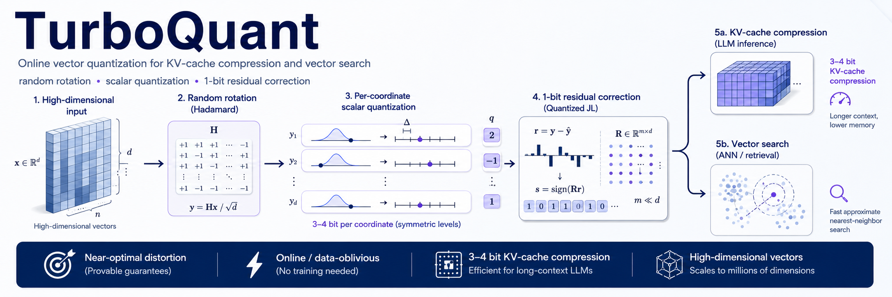

<p align="center">
  
</p>

<h1 align="center">TorbuQuant</h1>

<p align="center">
  <strong>LLM KV-cache compression, vector quantization, cache accounting, and serving-path experiments.</strong>
</p>

<p align="center">
  A <strong>Ginkgo<span style="color:#79863c">Q</span></strong> research implementation for measuring when compressed KV storage helps real long-context inference workloads.
</p>

---

## Purpose

TorbuQuant is a Python package for studying and implementing TurboQuant-style
LLM KV-cache compression. The repository keeps the research path and serving
path separate:

| Path | Role |
| --- | --- |
| Diagnostic path | Reconstructs or compares dense tensors so logits, attention outputs, and generation behavior can be inspected. |
| Serving path | Stores historical K/V in packed byte layouts and measures whether that storage can improve capacity under a memory bound. |

The project is built around three measurable goals:

1. Reduce KV-cache storage bytes while counting metadata and workspace.
2. Preserve model behavior under explicit quality gates.
3. Improve practical serving capacity when KV memory, context length, or batch size is the bottleneck.

## What Is In This Repository

| Area | Status |
| --- | --- |
| Codebooks | Exact Beta-sphere Lloyd-Max codebooks and Gaussian approximation. |
| Rotation | QR and RHT modes. |
| Vector quantization | MSE direction quantization with packed index storage. |
| QJL | Residual sign projection for vector and inner-product experiments. |
| KV formats | K16, K8, K4 and V8, V4, V3, V2 helpers. |
| Cache accounting | Packed bytes, norms, scales, zeros, metadata, recent windows, and workspace reports. |
| Attention | Dense, dequantized, direct-QK, packed-V, and selected Triton decode paths. |
| vLLM integration | Metadata, page geometry, page cache, registry, runtime selection, and verification helpers. |
| HuggingFace integration | Diagnostic DynamicCache wrapper and Qwen evaluation scripts. |
| Qwen A/B | Controlled baseline-vs-TurboQuant evaluation script with isolated run directories. |

Reference code under `other_implemnetations/` is used for audit and comparison.
TorbuQuant does not import those implementations.

## Install

Create and activate a Python environment, then install the repository from the
project root:

```bash
python -m venv .venv
source .venv/bin/activate
python -m pip install --upgrade pip
python -m pip install -e .
```

Install documentation dependencies when building the site:

```bash
python -m pip install -e ".[docs]"
python -m mkdocs build --strict
```

## Quick Checks

Run the repository test suite:

```bash
python -m pytest tests -q
```

Build the documentation site:

```bash
python -m mkdocs build --strict
```

Run the Qwen A/B evaluator with explicit scenario settings before making any
memory, quality, or speed statement:

```bash
python scripts/qwen_ab_eval.py --help
```

## Core Design Rules

TorbuQuant follows these rules throughout the codebase and reports:

- Do not claim speedup from storage compression alone.
- Do not claim memory reduction unless packed bytes, metadata, dense windows,
  and workspace are counted.
- Do not claim quality preservation from random tensor checks alone.
- Keep dense K/V materialization out of serving decode paths.
- Compare against optimized dense attention and available FP8/q8-style KV
  baselines when reporting production measurements.
- Label HuggingFace cache reconstruction as diagnostic behavior.

## Documentation

The MkDocs site is configured in `mkdocs.yml` and uses MkDocs Material with
`mkdocstrings` for API pages.

Important pages:

- `docs/design.md` explains route ownership and implementation boundaries.
- `docs/math.md` maps the paper math to repository objects.
- `docs/algorithms.md` describes quantization, packing, and decode flow.
- `docs/architecture.md` describes module responsibilities.
- `docs/usage/vllm.md` explains page geometry, metadata, and runtime dispatch.
- `docs/usage/qwen-ab.md` documents controlled model evaluation.

Visual identity:

- Browser favicon: `docs/assets/images/torbuquant-mark.svg`.
- Docs logo: `docs/assets/images/favicon.svg` from Ginkgo<span style="color:#79863c">Q</span>.
- README banner: `docs/assets/images/banner.png`.
- Primary accent: `#79863c`.

## Repository Map

```text
torbuquant/
  core/          codebooks, rotations, MSE quantization, QJL
  packing/       bit packing and byte accounting helpers
  kv/            compressed cache formats and memory reports
  attention/     dense, diagnostic, and packed-reference attention paths
  triton/        update/decode kernels and reference wrappers
  integration/   HuggingFace and vLLM integration layers
  quality/       comparison, retrieval, and generation metrics
scripts/         metadata, verification, benchmark, and Qwen A/B entry points
docs/            MkDocs Material publication site
tests/           unit and integration tests
```

## Measurement Discipline

Reports should include raw outputs and exact run settings. For each variant,
record:

- model name and revision,
- prompts and input lengths,
- generation settings,
- GPU and software versions,
- peak CUDA allocation and reservation,
- CPU and RAM usage,
- prompt and decode latency,
- throughput,
- dense KV byte estimate,
- compressed KV byte estimate,
- quality comparison notes.

If a target is not achieved, the report should say that plainly and include the
remaining gap.
