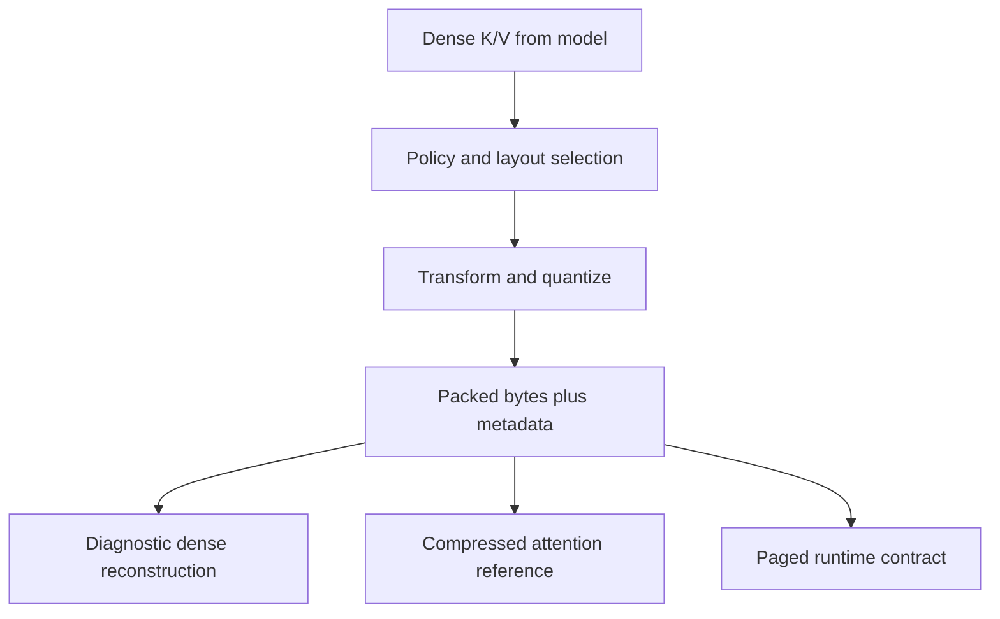
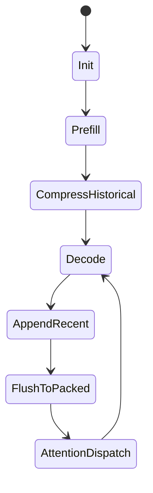

# Architecture

TorbuQuant is organized as a set of contracts around vector quantization,
cache ownership, attention consumption, and measurement. The goal is not merely
to compress tensors; the goal is to know which path owns bytes, which path
materializes dense tensors, and which path is valid for a given claim.

## Package Map

```text
turboquant/
  core/          vector quantization math
  packing/       bit packing utilities
  kv/            cache formats, policy, byte reports, cache owners
  attention/     dense and compressed reference attention
  triton/        Triton kernels and packed-page contracts
  integration/
    common/      runtime config, backend detection, reports
    hf/          HuggingFace capture and diagnostic cache wrappers
    vllm/        vLLM metadata, page layout, runtime selection
  quality/       tensor, logit, retrieval, and trajectory metrics
  bench/         external command builders and profile parsers
  weights/       experimental weight quantization helpers
  search/        vector-search helper path
```

## Responsibility Matrix

| Package | Responsibility | Typical inputs | Typical outputs |
| --- | --- | --- | --- |
| `core` | Vector transforms, codebooks, MSE, QJL, typed payloads. | Dense tensors, dimensions, bit widths, seeds. | Packed MSE/QJL payloads, reconstructed vectors. |
| `packing` | Bit-level storage operations. | Integer index tensors and sign tensors. | `uint8` bitstreams. |
| `kv` | Cache policy, K/V formats, memory reports, compressed stores. | K/V tensors, policies, recent-window settings. | Cache blocks/pages, byte ledgers, diagnostic dense views. |
| `attention` | Dense and compressed reference attention. | Query tensors and dense or compressed K/V. | Attention output and reports. |
| `triton` | Kernel wrappers and packed-page contracts. | Packed rows/pages and attention metadata. | Score tensors, decode outputs, kernel reports. |
| `integration.hf` | HuggingFace capture and diagnostic cache patching. | HF model/cache objects. | Captures, compressed diagnostic cache state, reports. |
| `integration.vllm` | vLLM metadata, cache dtype registry, page geometry, runtime selection. | vLLM-like configs, metadata JSON, page tensors. | Runtime context, page layout, verification reports. |
| `quality` | Model-facing and tensor-facing metrics. | Logits, generated tokens, text prompts, timings. | KL, match rates, retrieval tables, timing stats. |

## Data Flow



The arrow from packed bytes to diagnostic reconstruction is intentionally
separate from the arrow to compressed attention. The first path validates math;
the second path is the serving direction.

## Cache Lifecycle



The lifecycle maps to concrete repository components:

| Lifecycle step | Component |
| --- | --- |
| Init | `KVQuantConfig`, `KVQuantPolicy`, codebooks, rotations. |
| Prefill | dense K/V from model layer or capture helpers. |
| CompressHistorical | `CompressedKVCache`, MSE/value quantizers, `PackedPageCache`. |
| AppendRecent | `RecentWindow`. |
| FlushToPacked | block/page writers and slot mapping. |
| AttentionDispatch | dense, diagnostic, direct-QK, packed-V, or paged decode path. |

## Diagnostic vs Serving Paths

| Path | Dense historical K/V materialized? | Use |
| --- | --- | --- |
| Dense SDPA/FlashAttention | Yes | Baseline. |
| HuggingFace DynamicCache wrapper | Yes | Correctness and quality checks. |
| Diagnostic dequant attention | Yes | Layout and distortion checks. |
| Direct-QK reference | Keys are consumed in compressed form; values may use packed accumulation. | Reference validation. |
| TQ paged decode reference | Reads packed pages and reconstructs rows inside the loop. | Contract tests. |
| Live vLLM backend | Not yet wired in this repo. | Planned serving route. |

## Cache Storage Objects

### `CompressedKVCache`

Owns compressed sequence state in `turboquant.kv.cache`. It manages dense recent
tokens, compressed blocks, boundary policy, sparse side storage, and memory
reporting. Diagnostic dense reads are marked as such.

### `PackedPageCache`

Owns uint8 page tensors in `turboquant.integration.vllm.page_cache`.
Its shape is:

```text
[num_blocks, block_size, num_kv_heads, row_bytes]
```

The writer uses flat slot mapping and ignores negative slots, matching common
paged-cache update semantics.

### `CompressedDynamicCache`

Patches a HuggingFace `DynamicCache`. It stores compressed rows internally, but
returns dense tensors to HF attention. This is useful for model behavior checks.
It is not a serving-throughput path.

## vLLM Integration State

The repository includes vLLM-oriented modules:

- `recipe.py`
- `metadata.py`
- `calibration.py`
- `page_cache.py`
- `registry.py`
- `runtime.py`
- `verify.py`

These modules define contracts and validation helpers. They do not yet replace
vLLM's attention backend end to end.

## vLLM Runtime Mapping

| Concept | Local module | Notes |
| --- | --- | --- |
| cache dtype registry | `registry.py` | Recognizes TQ4 names and recipe names. |
| metadata JSON | `metadata.py` | Validates recipe, head dimension, group sizes, and layer names. |
| activation calibration | `calibration.py` | Hooks K/V projection modules and selects channels by energy. |
| page geometry | `page_cache.py` | Computes row and page byte counts. |
| runtime context | `runtime.py` | Selects decode/prefill route and metadata requirements. |
| verification | `verify.py` | Detects model shape and checks metadata or HF diagnostic cache behavior. |
| recipe vector rows | `vector.py` | Packs/unpacks grouped MSE+QJL rows. |

## Byte Accounting

`turboquant.kv.memory.MemoryReport` and vLLM report helpers distinguish:

- dense KV bytes,
- compressed K bytes,
- compressed V bytes,
- metadata and norms,
- recent-window bytes,
- total compressed bytes,
- ratio fields.

Reports must name the baseline and the path used.

## Kernel Boundary

The repository has two classes of code under `turboquant.triton`:

- actual Triton-oriented kernels and wrappers in `kernels.py`,
  `flash_attention_tq4_kv.py`, and `fused_paged_tq4_attention.py`;
- PyTorch contract implementations for TQ row packing and paged decode in
  `tq4_update.py` and `tq4_decode.py`.

The contract implementations are intentional. They define row layout and output
semantics before a Triton JIT path is wired to vLLM.
