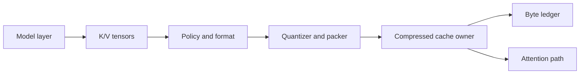

# Design

This page explains the repository design from the point of view of a developer
who needs to change the system without breaking the research contract or the
serving contract.

## Design Goals

TorbuQuant is built around three goals that must be evaluated together:

1. reduce KV-cache memory,
2. preserve model behavior under measured gates,
3. improve practical serving capacity when KV memory is the bottleneck.

The design rejects shortcuts that would make one metric look good while hiding
cost elsewhere. For example, a cache format that stores packed indices but
reconstructs the whole historical cache before attention is useful for
diagnostics, but it is not a serving-throughput path.

## System Invariants

| Invariant | Reason |
| --- | --- |
| Storage bytes and metadata bytes are reported separately. | Compression ratio must include norms, scales, zeros, codebooks, transforms, recent windows, and workspace. |
| Diagnostic routes are named in reports. | Dense reconstruction is allowed for validation, not for serving claims. |
| Production routes must consume packed historical K/V. | Memory reduction matters only if attention avoids dense historical cache tensors. |
| Key and value formats are independent. | Keys affect score routing; values affect output accumulation. |
| vLLM recipe modes require metadata. | High/low channel groups are a calibration artifact, not a runtime guess. |
| Unsupported serving formats raise. | Silent dense fallback would invalidate measurements. |

## Data Ownership



The cache owner is responsible for persistent bytes. The attention path is
responsible for how those bytes are consumed. This distinction matters:

- `CompressedKVCache` owns sequence-level compressed blocks and recent windows.
- `PackedPageCache` owns vLLM-style uint8 pages.
- `CompressedDynamicCache` patches a HuggingFace cache and owns compressed
  diagnostic state.
- `decode_tq4_paged` consumes pages through a block table.

## Layered Module Contract

| Layer | May depend on | Must not depend on |
| --- | --- | --- |
| `core` | PyTorch, NumPy, SciPy, packing | HF, vLLM, scripts |
| `packing` | PyTorch | model/runtime code |
| `kv` | `core`, `packing` | HF/vLLM internals |
| `attention` | `kv`, `core` | script-only code |
| `triton` | `core`, `packing`, PyTorch, Triton | HF cache wrappers |
| `integration.hf` | `kv`, `core`, Transformers when called | vLLM internals |
| `integration.vllm` | `kv`, `triton`, metadata helpers | reference repos |
| `quality` | PyTorch and standard libraries | runtime mutation |

This keeps the math reusable and prevents runtime adapters from becoming the
source of quantization truth.

## Diagnostic Route Design

Diagnostic routes exist to answer these questions:

- Does packing round-trip to finite values?
- How much vector reconstruction error does a format introduce?
- How close are compressed attention outputs to dense attention outputs?
- How do logits and generated text differ from the dense baseline?

Allowed diagnostic behavior:

- reconstructing dense K/V,
- Python loops for clarity,
- extra reports and assertions,
- running on CPU.

Not allowed for diagnostic evidence:

- claiming serving throughput,
- hiding dense reconstructed tensors from byte reports,
- comparing only against weak Python baselines when discussing runtime.

## Serving Route Design

The serving route is organized around page ownership and block tables:

```text
slot id -> physical block -> token offset -> packed row bytes
```

For a token slot:

```text
block = slot // block_size
offset = slot % block_size
```

The serving route must:

- write packed rows into persistent pages,
- use block tables for logical-to-physical mapping,
- read K rows inside score computation,
- read and dequantize V rows inside accumulation,
- keep workspace bounded by runtime shape,
- report unsupported formats rather than silently densifying.

The live vLLM backend is still open work. Current modules define contracts,
metadata, byte math, and reference behavior for this route.

## Format Strategy

Keys and values are not treated the same:

- Keys control attention score ranking. Small score errors can change which
  token receives probability mass.
- Values are consumed after softmax. They can often tolerate stronger
  compression, but error still affects logits.

The first practical policies favor:

- higher precision keys with compressed values,
- recent dense window,
- boundary-token preservation,
- measured fallback counters,
- long-context retrieval checks.

## Recipe Strategy

Recipe modes `turboquant25` and `turboquant35` split channels into high and low
groups. The high group is selected by calibration metadata:

```text
activation energy -> sorted high-precision indices -> metadata JSON
```

The recipe row stores two groups. Each group stores:

```text
[MSE indices][QJL signs][vector norm][residual norm]
```

This layout is not guessed from the tensor at runtime. Runtime must load
metadata, validate head dimension, validate group sizes, and slice by tensor
parallel partition when needed.

## Error Model

The repository treats errors as signals:

- `ValueError` for bad shapes, unsupported bit widths, malformed metadata, and
  invalid argument combinations.
- `IndexError` for slot mappings outside allocated pages.
- `FileNotFoundError` for missing recipe metadata.
- `ProductionModeError` when an HF route is asked to behave as a serving route
  without compressed attention.
- `UnsupportedFormatError` when a kernel route does not support a requested
  format.

Silent fallback is avoided in serving-facing paths because it corrupts
benchmark interpretation.

## Documentation Principle

Every public page must distinguish:

- implemented API,
- diagnostic behavior,
- serving contract,
- live serving path status,
- measured evidence,
- open work.

This is why the vLLM docs do not claim that the current repository has a live
vLLM backend, even though it has vLLM-oriented metadata, page, registry, and
runtime modules.

