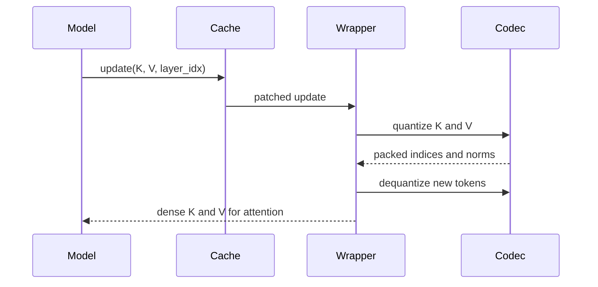

# HuggingFace Usage

## Diagnostic DynamicCache Wrapper

`torbuquant.integration.hf.CompressedDynamicCache` patches a Transformers
`DynamicCache` object. It stores compressed K/V rows internally, but it returns
dense tensors to HuggingFace attention.

```python
from transformers import DynamicCache
from torbuquant.integration.hf import CompressedDynamicCache

cache = DynamicCache()
wrapper = CompressedDynamicCache(
    cache,
    head_dim=128,
    bits=4,
)

# model.generate(..., past_key_values=cache)

print(wrapper.vram_bytes())
print(wrapper.baseline_vram_bytes())
print(wrapper.compression_stats())
wrapper.restore()
```

This route is diagnostic because HuggingFace attention receives dense tensors.

## Stored Representation

For each compressed layer, the wrapper stores:

| Field | Meaning |
| --- | --- |
| `indices` | Packed MSE centroid indices. |
| `norms` | fp32 vector norms. |
| `bits` | Bit width for that component. |
| `dim` | Head dimension. |

It also maintains dense dequantized buffers because standard HuggingFace
attention consumes dense K/V.

## Update Lifecycle



The wrapper appends compressed rows to its internal state. It appends
dequantized rows to dense buffers so decode steps do not reconstruct the entire
history on every call.

### Asymmetric K/V Bits

```python
wrapper = CompressedDynamicCache(
    cache,
    head_dim=128,
    bits=None,
    k_bits=4,
    v_bits=2,
)
```

`k_bits` and `v_bits` must both be given when `bits=None`.

### Lifecycle

| Method | Behavior |
| --- | --- |
| `enable()` | Use compressed update path. |
| `disable()` | Delegate updates to the original cache. |
| `restore()` | Restore patched cache methods. |
| context manager | Calls `restore()` on exit. |
| `get_compressed(layer_idx)` | Returns packed key indices, key norms, value indices, value norms. |

### Byte Report Methods

| Method | Counts |
| --- | --- |
| `vram_bytes()` | Internal compressed indices and norms. |
| `baseline_vram_bytes()` | Dense fp16 K/V estimate for compressed layers. |
| `compression_stats()` | Bits, layer count, sequence length, bytes, and context byte estimates. |

Bypassed layers are not counted as compressed layers.

### Shape Contract

Inputs to the patched update path must have:

```text
[batch, heads, tokens, head_dim]
```

Keys and values must have the same shape.

## Sliding/Global Layer Behavior

If `model_config.layer_types` contains both sliding and full-attention labels,
the wrapper bypasses full-attention layers. That mirrors the project policy that
long-context retrieval layers should not be compressed until measured gates pass
for that model.

Bypass means:

- update delegates to the original cache method,
- no compressed rows are stored for that layer,
- `get_compressed(layer_idx)` raises for that layer.

## Qwen Capture Helpers

`torbuquant.integration.hf.capture` provides:

- `capture_qwen_layer`
- `capture_generated_tokens`

These helpers load a HuggingFace model, register Q/K/V hooks for a chosen Qwen
layer, and return captured tensors and metadata. The capture route requires
model weights and may use substantial GPU memory.

## Existing Diagnostic Adapter

`HFDiagnosticCacheAdapter` in `torbuquant.integration.hf.qwen` converts a
`KVQuantConfig` into a `CompressedKVCache` and returns dense tensors for
HuggingFace attention. It rejects production mode.

## When To Use This Path

Use it for:

- checking model behavior against a dense baseline,
- measuring reconstruction impact,
- comparing generated text,
- collecting byte estimates,
- debugging cache lifecycle behavior.

Do not use it as evidence for serving throughput because it returns dense K/V
to HuggingFace attention.
