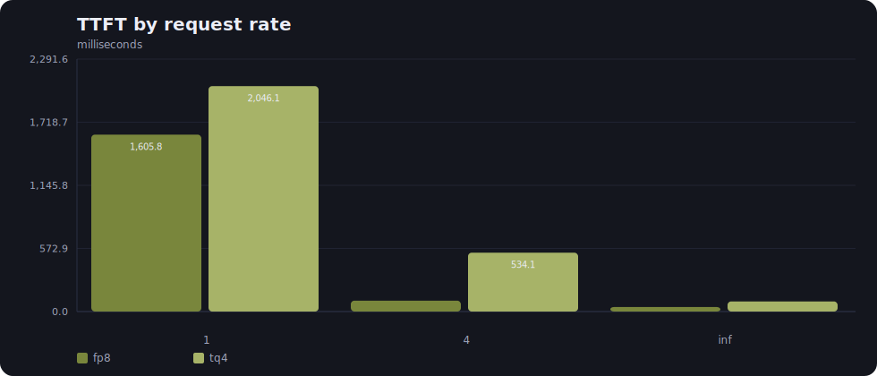
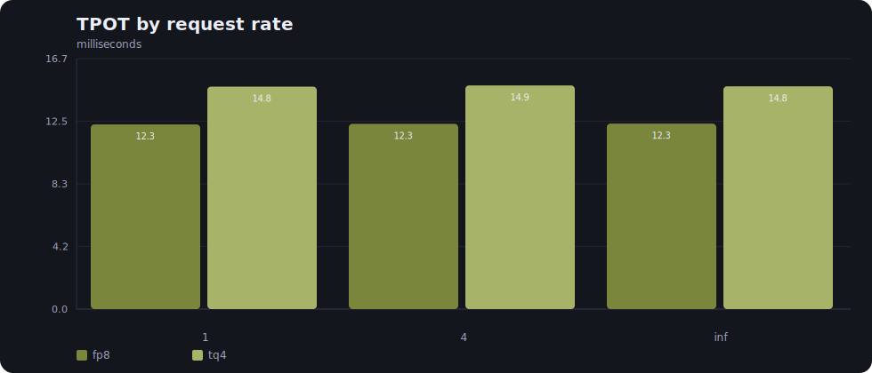
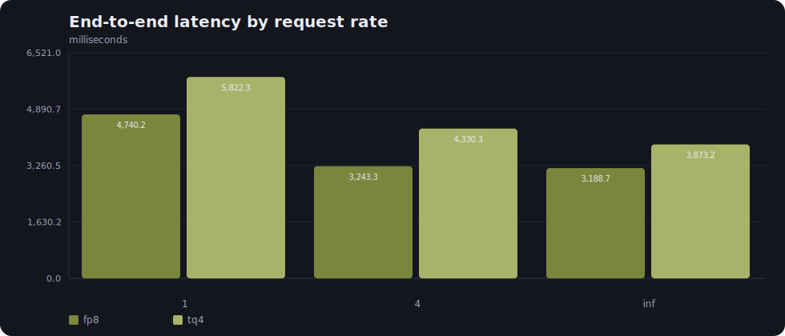
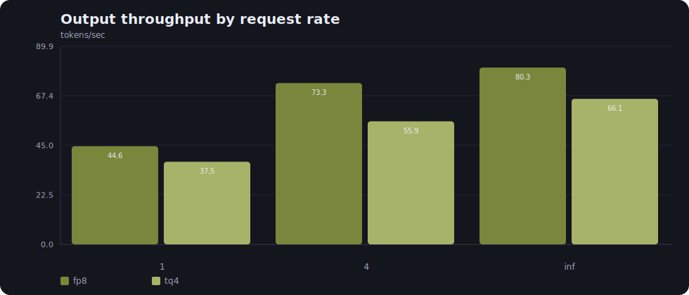
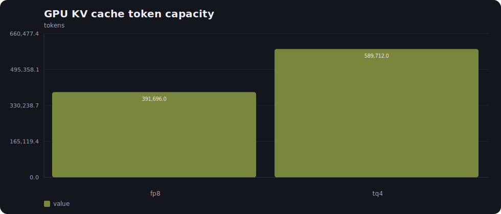
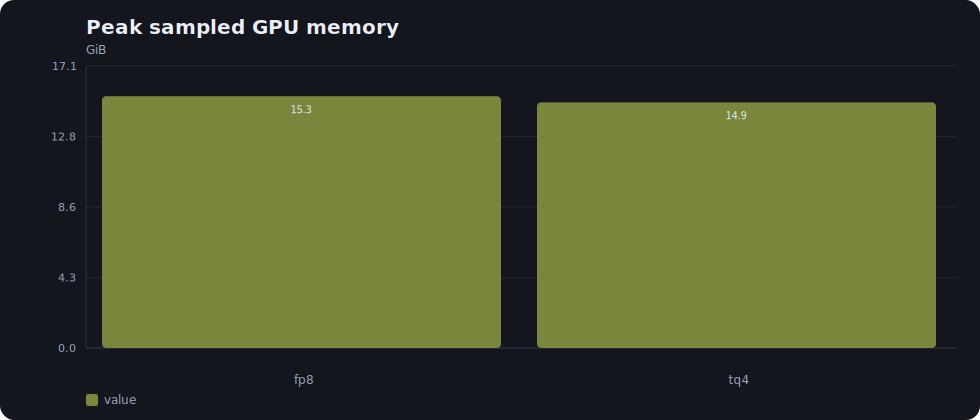
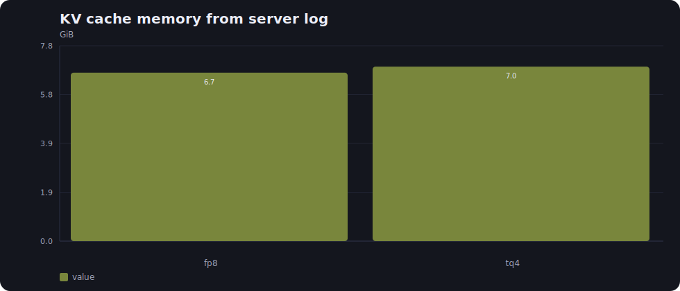

# vLLM FP8 vs TurboQuant Run Report

Source run directory: `/home/arman/project/turboquant_v2/reports/vllm_fp8_tq/20260523_195840`

This report is generated from saved run artifacts. It does not run inference and it does not fill missing values with assumptions.

## Run Identity

| Field | Value |
| --- | --- |
| Run ID | 20260523_195840 |
| Model | Qwen/Qwen2.5-3B |
| Context budget | 8,192 |
| Benchmark input tokens | 7,936 |
| Output tokens requested | 256 |
| Prompts per request-rate point | 1 |
| Request rates | 1, 4, inf |
| Tensor parallel size | 1 |
| GPU memory utilization | 0.90 |
| Model dtype | bfloat16 |
| Seed | 1,234 |
| Host | 127.0.0.1 |
| Base port | 8,800 |

## Runtime Environment

| Component | Value |
| --- | --- |
| Platform | Linux-6.8.0-117-generic-x86_64-with-glibc2.35 |
| Python executable | /home/arman/project/turboquant_v2/.venv/bin/python |
| Python version | 3.10.12 |
| Torch | 2.11.0+cu130 |
| Triton | 3.6.0 |
| Transformers | 5.9.0 |
| vLLM | 0.21.0 |
| GPU | NVIDIA GeForce RTX 4090 Laptop GPU |
| GPU memory total | 16376 MiB |
| Driver | 580.159.03 |
| PyTorch CUDA available | True |
| PyTorch CUDA devices | 1 |

## Variants

| Label | KV cache dtype | Startup seconds | Server log |
| --- | --- | --- | --- |
| fp8 | fp8 | 39.053 | reports/vllm_fp8_tq/20260523_195840/fp8/server.log |
| tq4 | turboquant_4bit_nc | 51.066 | reports/vllm_fp8_tq/20260523_195840/tq4/server.log |

vLLM CLI dtype support recorded in the run:

| KV cache dtype | Found |
| --- | --- |
| fp8 | True |
| turboquant_4bit_nc | True |

## Server Commands

### fp8

```text
/home/arman/project/turboquant_v2/.venv/bin/python -m vllm.entrypoints.cli.main serve Qwen/Qwen2.5-3B --host 127.0.0.1 --port 8800 --kv-cache-dtype fp8 --max-model-len 8192 --tensor-parallel-size 1 --gpu-memory-utilization 0.9 --dtype bfloat16
```

### tq4

```text
/home/arman/project/turboquant_v2/.venv/bin/python -m vllm.entrypoints.cli.main serve Qwen/Qwen2.5-3B --host 127.0.0.1 --port 8801 --kv-cache-dtype turboquant_4bit_nc --max-model-len 8192 --tensor-parallel-size 1 --gpu-memory-utilization 0.9 --dtype bfloat16
```

## Plots
















## Cache Capacity And Memory

| Variant | GPU KV cache tokens | Tokens/request in log | Max concurrency from log | KV cache memory from log | Peak GPU memory | Peak process RSS | Peak system RAM used |
| --- | --- | --- | --- | --- | --- | --- | --- |
| fp8 | 391,696 | 8,192 | 47.81 | 6.72 GiB | 15.27 GiB | 1.33 GiB | 21.25 GiB |
| tq4 | 589,712 | 8,192 | 71.99 | 6.96 GiB | 14.90 GiB | 1.33 GiB | 21.66 GiB |

Derived memory and capacity values use `fp8` as the reference.

| Variant | KV token capacity ratio | KV token capacity change % | Log KV memory reference/variant | Log KV memory change % | Peak GPU reference/variant | Peak GPU change % |
| --- | --- | --- | --- | --- | --- | --- |
| tq4 | 1.5055 | 50.55 | 0.9655 | 3.57 | 1.0250 | -2.44 |

## Latency

| Variant | Request rate | mean TTFT ms | median TTFT ms | p90 TTFT ms | p99 TTFT ms | mean TPOT ms | median TPOT ms | p90 TPOT ms | p99 TPOT ms | mean ITL ms | median ITL ms | p90 ITL ms | p99 ITL ms | mean E2EL ms | median E2EL ms | p90 E2EL ms | p99 E2EL ms |
| --- | --- | --- | --- | --- | --- | --- | --- | --- | --- | --- | --- | --- | --- | --- | --- | --- | --- |
| fp8 | 1 | 1,605.761 | 1,605.761 | 1,605.761 | 1,605.761 | 12.292 | 12.292 | 12.292 | 12.292 | 12.292 | 12.343 | 12.585 | 12.935 | 4,740.176 | 4,740.176 | 4,740.176 | 4,740.176 |
| fp8 | 4 | 98.713 | 98.713 | 98.713 | 98.713 | 12.332 | 12.332 | 12.332 | 12.332 | 12.332 | 12.343 | 12.928 | 13.954 | 3,243.285 | 3,243.285 | 3,243.285 | 3,243.285 |
| fp8 | inf | 40.933 | 40.933 | 40.933 | 40.933 | 12.344 | 12.344 | 12.344 | 12.344 | 12.344 | 12.361 | 12.759 | 13.359 | 3,188.668 | 3,188.668 | 3,188.668 | 3,188.668 |
| tq4 | 1 | 2,046.080 | 2,046.080 | 2,046.080 | 2,046.080 | 14.809 | 14.809 | 14.809 | 14.809 | 14.809 | 14.870 | 15.081 | 15.539 | 5,822.312 | 5,822.312 | 5,822.312 | 5,822.312 |
| tq4 | 4 | 534.082 | 534.082 | 534.082 | 534.082 | 14.887 | 14.887 | 14.887 | 14.887 | 14.887 | 14.870 | 15.141 | 15.695 | 4,330.334 | 4,330.334 | 4,330.334 | 4,330.334 |
| tq4 | inf | 91.768 | 91.768 | 91.768 | 91.768 | 14.829 | 14.829 | 14.829 | 14.829 | 14.829 | 14.868 | 15.127 | 16.371 | 3,873.216 | 3,873.216 | 3,873.216 | 3,873.216 |

## Raw Distribution Checks

This table is computed from raw arrays such as `ttfts`, `itls`, `input_lens`, and `output_lens` when those arrays are present.

| Variant | Request rate | TTFT samples | TTFT p50 | TTFT p90 | TTFT p99 | ITL p50 | ITL p90 | ITL p99 | Per-request ITL mean p50 | Input p50 | Output p50 |
| --- | --- | --- | --- | --- | --- | --- | --- | --- | --- | --- | --- |
| fp8 | 1 | 1 | 1,605.761 | 1,605.761 | 1,605.761 | 12.343 | 12.585 | 12.935 | 12.292 | 7,936.0 | 256.0 |
| fp8 | 4 | 1 | 98.713 | 98.713 | 98.713 | 12.343 | 12.928 | 13.954 | 12.332 | 7,936.0 | 256.0 |
| fp8 | inf | 1 | 40.933 | 40.933 | 40.933 | 12.361 | 12.759 | 13.359 | 12.344 | 7,936.0 | 256.0 |
| tq4 | 1 | 1 | 2,046.080 | 2,046.080 | 2,046.080 | 14.870 | 15.081 | 15.539 | 14.809 | 7,936.0 | 256.0 |
| tq4 | 4 | 1 | 534.082 | 534.082 | 534.082 | 14.870 | 15.141 | 15.695 | 14.887 | 7,936.0 | 256.0 |
| tq4 | inf | 1 | 91.768 | 91.768 | 91.768 | 14.868 | 15.127 | 16.371 | 14.829 | 7,936.0 | 256.0 |

## Throughput And Tokens

| Variant | Request rate | Duration | Done | Failed | Input tokens | Output tokens | Req/s | Output tok/s | Total tok/s | Max concurrent requests |
| --- | --- | --- | --- | --- | --- | --- | --- | --- | --- | --- |
| fp8 | 1 | 5.742 | 1 | 0 | 7,936 | 256 | 0.174 | 44.584 | 1,426.701 | 1 |
| fp8 | 4 | 3.495 | 1 | 0 | 7,936 | 256 | 0.286 | 73.258 | 2,344.241 | 1 |
| fp8 | inf | 3.189 | 1 | 0 | 7,936 | 256 | 0.314 | 80.280 | 2,568.973 | 1 |
| tq4 | 1 | 6.824 | 1 | 0 | 7,936 | 256 | 0.147 | 37.514 | 1,200.455 | 1 |
| tq4 | 4 | 4.581 | 1 | 0 | 7,936 | 256 | 0.218 | 55.878 | 1,788.097 | 1 |
| tq4 | inf | 3.873 | 1 | 0 | 7,936 | 256 | 0.258 | 66.090 | 2,114.891 | 1 |

## Variant Ratios Versus `fp8`

Ratios above 1.0 favor the numerator direction named in the column. Latency ratios use reference divided by variant; throughput ratios use variant divided by reference.

| Variant | Request rate | Reference TTFT / variant TTFT | Reference TPOT / variant TPOT | Reference E2EL / variant E2EL | Variant output tok/s / reference | Variant req/s / reference | Variant - reference TTFT ms | Variant - reference TPOT ms |
| --- | --- | --- | --- | --- | --- | --- | --- | --- |
| tq4 | 1 | 0.7848 | 0.8300 | 0.8141 | 0.8414 | 0.8414 | 440.318 | 2.517 |
| tq4 | 4 | 0.1848 | 0.8283 | 0.7490 | 0.7628 | 0.7628 | 435.369 | 2.556 |
| tq4 | inf | 0.4461 | 0.8324 | 0.8233 | 0.8232 | 0.8232 | 50.834 | 2.485 |

## Resource Sampling

| Variant | Samples | Mean process CPU % | Max process CPU % | Mean GPU util % | Max GPU util % | Max GPU mem util % | Max GPU used | Max system RAM % |
| --- | --- | --- | --- | --- | --- | --- | --- | --- |
| fp8 | 380 | 2.267 | 59.200 | 26.316 | 100.000 | 100.000 | 15.27 GiB | 34.000 |
| tq4 | 412 | 1.616 | 59.300 | 31.165 | 100.000 | 92.000 | 14.90 GiB | 34.700 |

## Prometheus Cache Metrics

| Variant | Metric | Before | After | Delta |
| --- | --- | --- | --- | --- |
| fp8 | vllm:kv_cache_usage_perc | 0.000 | 0.000 | 0.000 |
| fp8 | vllm:prefix_cache_queries_total | 0.000 | 31,936.000 | 31,936.000 |
| fp8 | vllm:prefix_cache_hits_total | 0.000 | 15,840.000 | 15,840.000 |
| fp8 | vllm:prompt_tokens_cached_total | 0.000 | 15,840.000 | 15,840.000 |
| fp8 | vllm:request_prefill_kv_computed_tokens_count | 0.000 | 4.000 | 4.000 |
| fp8 | vllm:request_prefill_kv_computed_tokens_sum | 0.000 | 16,096.000 | 16,096.000 |
| tq4 | vllm:kv_cache_usage_perc | 0.000 | 0.000 | 0.000 |
| tq4 | vllm:prefix_cache_queries_total | 0.000 | 31,936.000 | 31,936.000 |
| tq4 | vllm:prefix_cache_hits_total | 0.000 | 15,840.000 | 15,840.000 |
| tq4 | vllm:prompt_tokens_cached_total | 0.000 | 15,840.000 | 15,840.000 |
| tq4 | vllm:request_prefill_kv_computed_tokens_count | 0.000 | 4.000 | 4.000 |
| tq4 | vllm:request_prefill_kv_computed_tokens_sum | 0.000 | 16,096.000 | 16,096.000 |

## Quality Probes

| Variant | Probe | Prompt tokens | Expected | Contains expected | TTFT ms | TPOT ms | Total latency ms | Output excerpt |
| --- | --- | --- | --- | --- | --- | --- | --- | --- |
| fp8 | niah_8k | 8128 | GINKGOQ-8192 | False | n/a | n/a | 863.013 | `` |
| tq4 | niah_8k | 8128 | GINKGOQ-8192 | True | 846.449 | 14.775 | 1,053.599 | ` The secret code is GINKGOQ-8192.` |

## Generated Text Excerpts

Full generated text is kept in the benchmark JSON files. This table lists the first saved text per point and non-empty error count.

| Variant | Request rate | Saved texts | Non-empty errors | First text excerpt | First error excerpt |
| --- | --- | --- | --- | --- | --- |
| fp8 | 1 | 1 | 0 | `\r\n 	} 	} 	} 	} 	} 	} 	} 	} 	} 	} 	} 	} 	} 	} 	} 	} 	} 	} 	} 	} 	} 	} 	} 	} 	} 	} 	} 	} 	} 	} 	} 	} 	} 	} 	} 	} 	} 	} 	} 	} 	} 	} 	} 	} 	} 	} 	} 	} 	} 	} 	} 	} 	} 	} 	} 	} 	} 	} ...` | `` |
| fp8 | 4 | 1 | 0 | `\r\n 	} 	} 	} 	} 	} 	} 	} 	} 	} 	} 	} 	} 	} 	} 	} 	} 	} 	} 	} 	} 	} 	} 	} 	} 	} 	} 	} 	} 	} 	} 	} 	} 	} 	} 	} 	} 	} 	} 	} 	} 	} 	} 	} 	} 	} 	} 	} 	} 	} 	} 	} 	} 	} 	} 	} 	} 	} 	} ...` | `` |
| fp8 | inf | 1 | 0 | `\r\n 	} 	} 	} 	} 	} 	} 	} 	} 	} 	} 	} 	} 	} 	} 	} 	} 	} 	} 	} 	} 	} 	} 	} 	} 	} 	} 	} 	} 	} 	} 	} 	} 	} 	} 	} 	} 	} 	} 	} 	} 	} 	} 	} 	} 	} 	} 	} 	} 	} 	} 	} 	} 	} 	} 	} 	} 	} 	} ...` | `` |
| tq4 | 1 | 1 | 0 | `\r\n 100000000000000000000000000000000000000000000000000000000000000000000000000000000000000000000000000000000000000000000000000000000000000000000000000000000000000000000000000000...` | `` |
| tq4 | 4 | 1 | 0 | `\r\n 100000000000000000000000000000000000000000000000000000000000000000000000000000000000000000000000000000000000000000000000000000000000000000000000000000000000000000000000000000...` | `` |
| tq4 | inf | 1 | 0 | `\r\n 100000000000000000000000000000000000000000000000000000000000000000000000000000000000000000000000000000000000000000000000000000000000000000000000000000000000000000000000000000...` | `` |

## Stability

| Variant | Request rate | Prompts | Done | Failed | Non-empty errors | Error excerpt |
| --- | --- | --- | --- | --- | --- | --- |
| fp8 | 1 | 1 | 1 | 0 | 0 | n/a |
| fp8 | 4 | 1 | 1 | 0 | 0 | n/a |
| fp8 | inf | 1 | 1 | 0 | 0 | n/a |
| tq4 | 1 | 1 | 1 | 0 | 0 | n/a |
| tq4 | 4 | 1 | 1 | 0 | 0 | n/a |
| tq4 | inf | 1 | 1 | 0 | 0 | n/a |

## Limits Bound To This Run

- The benchmark contains `1` prompt(s) per request-rate point.
- Percentiles are only as meaningful as the number of saved per-request samples.
- Request-rate points are not the same as sustained high concurrency unless the raw benchmark records multiple simultaneous requests.
- Memory fields come from different sources: server logs, resource samples, and Prometheus metrics. They should be interpreted separately.
- This report makes no claim outside the saved run artifacts.

## Artifact Index

| Path | Bytes |
| --- | --- |
| fp8/bench_fp8_1.stderr.txt | 0 |
| fp8/bench_fp8_1.stdout.txt | 4,732 |
| fp8/bench_fp8_4.stderr.txt | 0 |
| fp8/bench_fp8_4.stdout.txt | 4,732 |
| fp8/bench_fp8_inf.stderr.txt | 0 |
| fp8/bench_fp8_inf.stdout.txt | 4,682 |
| fp8/fp8_rate_1.json | 7,554 |
| fp8/fp8_rate_4.json | 7,550 |
| fp8/fp8_rate_inf.json | 7,553 |
| fp8/quality_niah_8k.json | 282 |
| fp8/server.log | 19,118 |
| fp8/variant_report.json | 44,905 |
| manifest.json | 3,414 |
| plots/e2el_ms.svg | 2,942 |
| plots/kv_cache_tokens.svg | 2,022 |
| plots/kv_memory_gib.svg | 1,987 |
| plots/output_tps.svg | 2,909 |
| plots/peak_gpu_gib.svg | 1,983 |
| plots/request_tps.svg | 2,902 |
| plots/tpot_ms.svg | 2,894 |
| plots/ttft_ms.svg | 2,637 |
| report.json | 106,640 |
| run_report.md | 12,460 |
| tq4/bench_tq4_1.stderr.txt | 0 |
| tq4/bench_tq4_1.stdout.txt | 4,747 |
| tq4/bench_tq4_4.stderr.txt | 0 |
| tq4/bench_tq4_4.stdout.txt | 4,747 |
| tq4/bench_tq4_inf.stderr.txt | 0 |
| tq4/bench_tq4_inf.stdout.txt | 4,697 |
| tq4/quality_niah_8k.json | 652 |
| tq4/server.log | 20,836 |
| tq4/tq4_rate_1.json | 7,484 |
| tq4/tq4_rate_4.json | 7,472 |
| tq4/tq4_rate_inf.json | 7,487 |
| tq4/variant_report.json | 45,176 |
