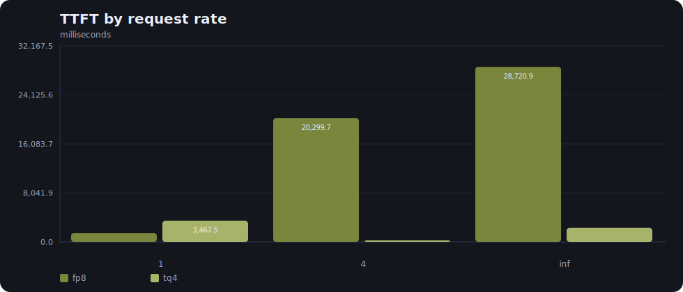
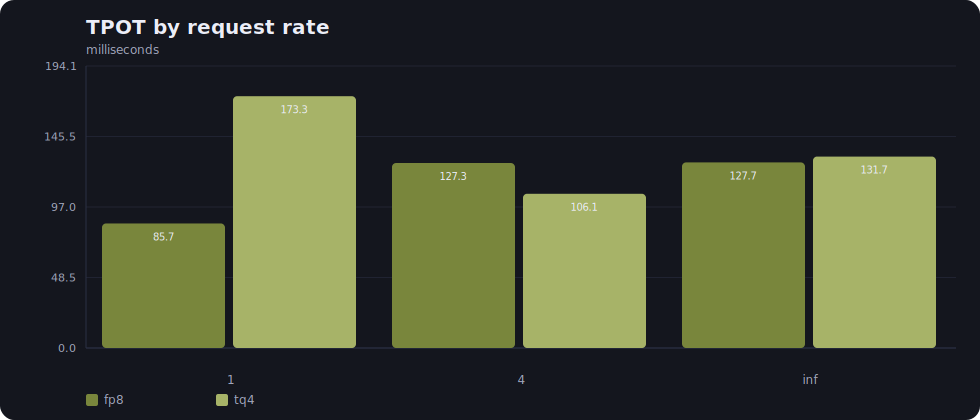
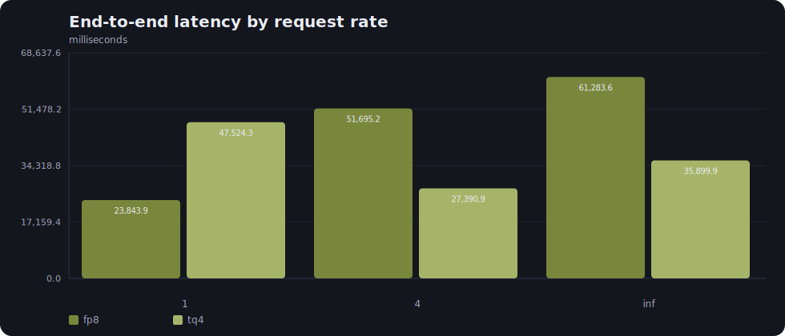
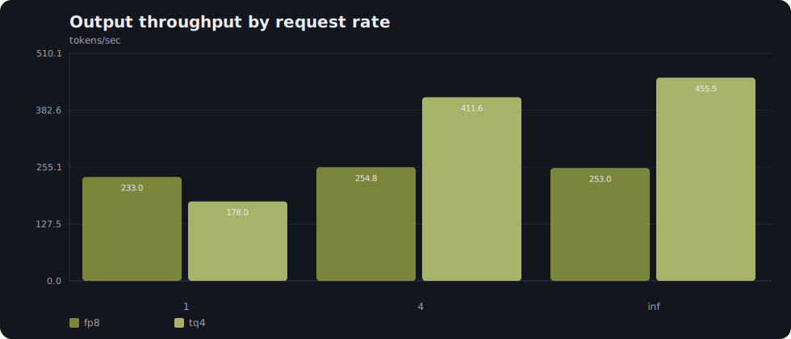
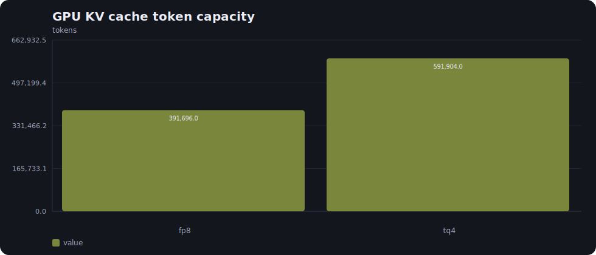
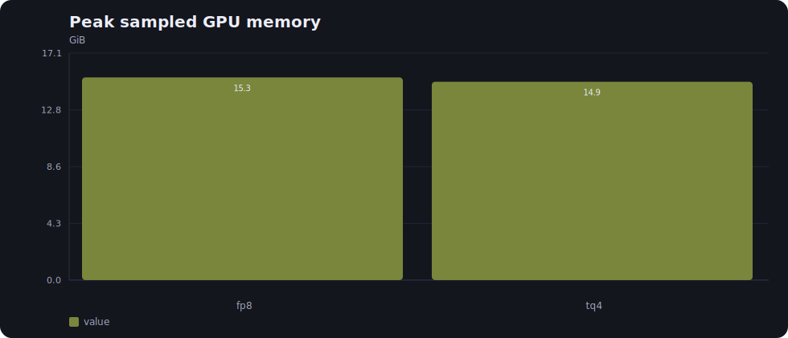
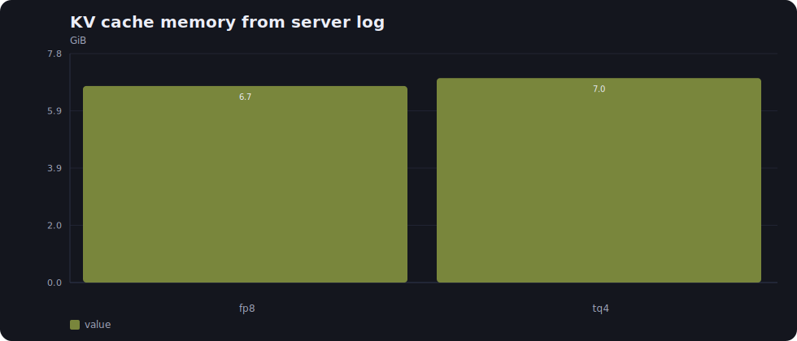

# vLLM FP8 vs TurboQuant Run Report

Source run directory: `/home/arman/project/turboquant_v2/reports/vllm_fp8_tq/20260523_201110`

This report is generated from saved run artifacts. It does not run inference and it does not fill missing values with assumptions.

## Run Identity

| Field | Value |
| --- | --- |
| Run ID | 20260523_201110 |
| Model | Qwen/Qwen2.5-3B |
| Context budget | 8,192 |
| Benchmark input tokens | 7,936 |
| Output tokens requested | 256 |
| Prompts per request-rate point | 64 |
| Request rates | 1, 4, inf |
| Tensor parallel size | 1 |
| GPU memory utilization | 0.90 |
| Model dtype | bfloat16 |
| Seed | 1,234 |
| Host | 127.0.0.1 |
| Base port | 8,800 |

## Runtime Environment

| Component | Value |
| --- | --- |
| Platform | Linux-6.8.0-117-generic-x86_64-with-glibc2.35 |
| Python executable | /home/arman/project/turboquant_v2/.venv/bin/python |
| Python version | 3.10.12 |
| Torch | 2.11.0+cu130 |
| Triton | 3.6.0 |
| Transformers | 5.9.0 |
| vLLM | 0.21.0 |
| GPU | NVIDIA GeForce RTX 4090 Laptop GPU |
| GPU memory total | 16376 MiB |
| Driver | 580.159.03 |
| PyTorch CUDA available | True |
| PyTorch CUDA devices | 1 |

## Variants

| Label | KV cache dtype | Startup seconds | Server log |
| --- | --- | --- | --- |
| fp8 | fp8 | 34.062 | reports/vllm_fp8_tq/20260523_201110/fp8/server.log |
| tq4 | turboquant_4bit_nc | 39.058 | reports/vllm_fp8_tq/20260523_201110/tq4/server.log |

vLLM CLI dtype support recorded in the run:

| KV cache dtype | Found |
| --- | --- |
| fp8 | True |
| turboquant_4bit_nc | True |

## Server Commands

### fp8

```text
/home/arman/project/turboquant_v2/.venv/bin/python -m vllm.entrypoints.cli.main serve Qwen/Qwen2.5-3B --host 127.0.0.1 --port 8800 --kv-cache-dtype fp8 --max-model-len 8192 --tensor-parallel-size 1 --gpu-memory-utilization 0.9 --dtype bfloat16
```

### tq4

```text
/home/arman/project/turboquant_v2/.venv/bin/python -m vllm.entrypoints.cli.main serve Qwen/Qwen2.5-3B --host 127.0.0.1 --port 8801 --kv-cache-dtype turboquant_4bit_nc --max-model-len 8192 --tensor-parallel-size 1 --gpu-memory-utilization 0.9 --dtype bfloat16
```

## Plots
















## Cache Capacity And Memory

| Variant | GPU KV cache tokens | Tokens/request in log | Max concurrency from log | KV cache memory from log | Peak GPU memory | Peak process RSS | Peak system RAM used |
| --- | --- | --- | --- | --- | --- | --- | --- |
| fp8 | 391,696 | 8,192 | 47.81 | 6.72 GiB | 15.27 GiB | 1.36 GiB | 22.54 GiB |
| tq4 | 591,904 | 8,192 | 72.25 | 6.99 GiB | 14.94 GiB | 1.36 GiB | 23.06 GiB |

Derived memory and capacity values use `fp8` as the reference.

| Variant | KV token capacity ratio | KV token capacity change % | Log KV memory reference/variant | Log KV memory change % | Peak GPU reference/variant | Peak GPU change % |
| --- | --- | --- | --- | --- | --- | --- |
| tq4 | 1.5111 | 51.11 | 0.9614 | 4.02 | 1.0220 | -2.15 |

## Latency

| Variant | Request rate | mean TTFT ms | median TTFT ms | p90 TTFT ms | p99 TTFT ms | mean TPOT ms | median TPOT ms | p90 TPOT ms | p99 TPOT ms | mean ITL ms | median ITL ms | p90 ITL ms | p99 ITL ms | mean E2EL ms | median E2EL ms | p90 E2EL ms | p99 E2EL ms |
| --- | --- | --- | --- | --- | --- | --- | --- | --- | --- | --- | --- | --- | --- | --- | --- | --- | --- |
| fp8 | 1 | 2,165.769 | 1,459.786 | 5,004.796 | 6,666.189 | 73.843 | 85.690 | 105.844 | 112.614 | 73.843 | 21.342 | 233.329 | 252.774 | 20,995.760 | 23,843.854 | 28,215.576 | 29,980.834 |
| fp8 | 4 | 21,314.216 | 20,299.738 | 39,609.368 | 42,847.087 | 117.413 | 127.282 | 171.970 | 172.979 | 117.413 | 28.105 | 247.809 | 262.711 | 51,254.642 | 51,695.242 | 54,406.712 | 54,973.625 |
| fp8 | inf | 29,538.004 | 28,720.948 | 53,928.344 | 59,200.338 | 117.767 | 127.697 | 172.511 | 173.548 | 117.767 | 27.999 | 248.344 | 265.096 | 59,568.643 | 61,283.563 | 64,372.057 | 64,670.056 |
| tq4 | 1 | 4,686.998 | 3,467.516 | 10,256.433 | 12,708.768 | 175.429 | 173.260 | 244.140 | 254.726 | 175.429 | 116.146 | 319.699 | 360.134 | 49,421.353 | 47,524.310 | 64,411.206 | 66,307.190 |
| tq4 | 4 | 280.845 | 274.257 | 438.343 | 516.191 | 100.824 | 106.119 | 111.359 | 111.686 | 100.824 | 110.231 | 127.126 | 185.232 | 25,990.847 | 27,390.883 | 28,660.366 | 28,749.118 |
| tq4 | inf | 1,864.300 | 2,309.937 | 2,512.091 | 2,520.879 | 133.012 | 131.726 | 136.032 | 136.205 | 133.012 | 132.286 | 134.313 | 153.129 | 35,782.240 | 35,899.886 | 35,951.392 | 35,960.565 |

## Raw Distribution Checks

This table is computed from raw arrays such as `ttfts`, `itls`, `input_lens`, and `output_lens` when those arrays are present.

| Variant | Request rate | TTFT samples | TTFT p50 | TTFT p90 | TTFT p99 | ITL p50 | ITL p90 | ITL p99 | Per-request ITL mean p50 | Input p50 | Output p50 |
| --- | --- | --- | --- | --- | --- | --- | --- | --- | --- | --- | --- |
| fp8 | 1 | 64 | 1,459.786 | 5,004.796 | 6,666.189 | 21.342 | 233.329 | 252.774 | 85.690 | 7,936.0 | 256.0 |
| fp8 | 4 | 64 | 20,299.738 | 39,609.368 | 42,847.087 | 28.105 | 247.809 | 262.711 | 127.282 | 7,936.0 | 256.0 |
| fp8 | inf | 64 | 28,720.948 | 53,928.344 | 59,200.338 | 27.999 | 248.344 | 265.096 | 127.697 | 7,936.0 | 256.0 |
| tq4 | 1 | 64 | 3,467.516 | 10,256.433 | 12,708.768 | 116.146 | 319.699 | 360.134 | 173.260 | 7,936.0 | 256.0 |
| tq4 | 4 | 64 | 274.257 | 438.343 | 516.191 | 110.231 | 127.126 | 185.232 | 106.119 | 7,936.0 | 256.0 |
| tq4 | inf | 64 | 2,309.937 | 2,512.091 | 2,520.879 | 132.286 | 134.313 | 153.129 | 131.726 | 7,936.0 | 256.0 |

## Throughput And Tokens

| Variant | Request rate | Duration | Done | Failed | Input tokens | Output tokens | Req/s | Output tok/s | Total tok/s | Max concurrent requests |
| --- | --- | --- | --- | --- | --- | --- | --- | --- | --- | --- |
| fp8 | 1 | 70.316 | 64 | 0 | 507,904 | 16,384 | 0.910 | 233.006 | 7,456.189 | 32 |
| fp8 | 4 | 64.312 | 64 | 0 | 507,904 | 16,384 | 0.995 | 254.757 | 8,152.232 | 64 |
| fp8 | inf | 64.757 | 64 | 0 | 507,904 | 16,384 | 0.988 | 253.008 | 8,096.241 | 64 |
| tq4 | 1 | 92.027 | 64 | 0 | 507,904 | 16,384 | 0.695 | 178.035 | 5,697.132 | 56 |
| tq4 | 4 | 39.805 | 64 | 0 | 507,904 | 16,384 | 1.608 | 411.604 | 13,171.318 | 62 |
| tq4 | inf | 35.971 | 64 | 0 | 507,904 | 16,384 | 1.779 | 455.483 | 14,575.471 | 64 |

## Variant Ratios Versus `fp8`

Ratios above 1.0 favor the numerator direction named in the column. Latency ratios use reference divided by variant; throughput ratios use variant divided by reference.

| Variant | Request rate | Reference TTFT / variant TTFT | Reference TPOT / variant TPOT | Reference E2EL / variant E2EL | Variant output tok/s / reference | Variant req/s / reference | Variant - reference TTFT ms | Variant - reference TPOT ms |
| --- | --- | --- | --- | --- | --- | --- | --- | --- |
| tq4 | 1 | 0.4210 | 0.4946 | 0.5017 | 0.7641 | 0.7641 | 2,007.731 | 87.569 |
| tq4 | 4 | 74.0173 | 1.1994 | 1.8873 | 1.6157 | 1.6157 | -20,025.481 | -21.162 |
| tq4 | inf | 12.4337 | 0.9694 | 1.7071 | 1.8003 | 1.8003 | -26,411.012 | 4.029 |

## Resource Sampling

| Variant | Samples | Mean process CPU % | Max process CPU % | Mean GPU util % | Max GPU util % | Max GPU mem util % | Max GPU used | Max system RAM % |
| --- | --- | --- | --- | --- | --- | --- | --- | --- |
| fp8 | 2,382 | 3.727 | 118.800 | 83.543 | 100.000 | 100.000 | 15.27 GiB | 36.100 |
| tq4 | 2,020 | 5.088 | 128.600 | 82.490 | 100.000 | 74.000 | 14.94 GiB | 36.900 |

## Prometheus Cache Metrics

| Variant | Metric | Before | After | Delta |
| --- | --- | --- | --- | --- |
| fp8 | vllm:kv_cache_usage_perc | 0.000 | 0.000 | 0.000 |
| fp8 | vllm:prefix_cache_queries_total | 0.000 | 2,785,728.000 | 2,785,728.000 |
| fp8 | vllm:prefix_cache_hits_total | 0.000 | 0.000 | 0.000 |
| fp8 | vllm:prompt_tokens_cached_total | 0.000 | 0.000 | 0.000 |
| fp8 | vllm:request_prefill_kv_computed_tokens_count | 0.000 | 193.000 | 193.000 |
| fp8 | vllm:request_prefill_kv_computed_tokens_sum | 0.000 | 1,531,840.000 | 1,531,840.000 |
| tq4 | vllm:kv_cache_usage_perc | 0.000 | 0.000 | 0.000 |
| tq4 | vllm:prefix_cache_queries_total | 0.000 | 1,531,840.000 | 1,531,840.000 |
| tq4 | vllm:prefix_cache_hits_total | 0.000 | 1,013,760.000 | 1,013,760.000 |
| tq4 | vllm:prompt_tokens_cached_total | 0.000 | 1,013,760.000 | 1,013,760.000 |
| tq4 | vllm:request_prefill_kv_computed_tokens_count | 0.000 | 193.000 | 193.000 |
| tq4 | vllm:request_prefill_kv_computed_tokens_sum | 0.000 | 518,080.000 | 518,080.000 |

## Quality Probes

| Variant | Probe | Prompt tokens | Expected | Contains expected | TTFT ms | TPOT ms | Total latency ms | Output excerpt |
| --- | --- | --- | --- | --- | --- | --- | --- | --- |
| fp8 | niah_8k | 8128 | GINKGOQ-8192 | False | n/a | n/a | 915.156 | `` |
| tq4 | niah_8k | 8128 | GINKGOQ-8192 | True | 881.862 | 14.895 | 1,090.908 | ` The secret code is GINKGOQ-8192.` |

## Generated Text Excerpts

Full generated text is kept in the benchmark JSON files. This table lists the first saved text per point and non-empty error count.

| Variant | Request rate | Saved texts | Non-empty errors | First text excerpt | First error excerpt |
| --- | --- | --- | --- | --- | --- |
| fp8 | 1 | 64 | 0 | `\r\n 	} 	} 	} 	} 	} 	} 	} 	} 	} 	} 	} 	} 	} 	} 	} 	} 	} 	} 	} 	} 	} 	} 	} 	} 	} 	} 	} 	} 	} 	} 	} 	} 	} 	} 	} 	} 	} 	} 	} 	} 	} 	} 	} 	} 	} 	} 	} 	} 	} 	} 	} 	} 	} 	} 	} 	} 	} 	} ...` | `` |
| fp8 | 4 | 64 | 0 | `\r\n 	} 	} 	} 	} 	} 	} 	} 	} 	} 	} 	} 	} 	} 	} 	} 	} 	} 	} 	} 	} 	} 	} 	} 	} 	} 	} 	} 	} 	} 	} 	} 	} 	} 	} 	} 	} 	} 	} 	} 	} 	} 	} 	} 	} 	} 	} 	} 	} 	} 	} 	} 	} 	} 	} 	} 	} 	} 	} ...` | `` |
| fp8 | inf | 64 | 0 | `\r\n 	} 	} 	} 	} 	} 	} 	} 	} 	} 	} 	} 	} 	} 	} 	} 	} 	} 	} 	} 	} 	} 	} 	} 	} 	} 	} 	} 	} 	} 	} 	} 	} 	} 	} 	} 	} 	} 	} 	} 	} 	} 	} 	} 	} 	} 	} 	} 	} 	} 	} 	} 	} 	} 	} 	} 	} 	} 	} ...` | `` |
| tq4 | 1 | 64 | 0 | `\r\n 100000000000000000000000000000000000000000000000000000000000000000000000000000000000000000000000000000000000000000000000000000000000000000000000000000000000000000000000000000...` | `` |
| tq4 | 4 | 64 | 0 | `\r\n.100000000000000000000000000000000000000000000000000000000000000000000000000000000000000000000000000000000000000000000000000000000000000000000000000000000000000000000000000000...` | `` |
| tq4 | inf | 64 | 0 | `\r\n.100000000000000000000000000000000000000000000000000000000000000000000000000000000000000000000000000000000000000000000000000000000000000000000000000000000000000000000000000000...` | `` |

## Stability

| Variant | Request rate | Prompts | Done | Failed | Non-empty errors | Error excerpt |
| --- | --- | --- | --- | --- | --- | --- |
| fp8 | 1 | 64 | 64 | 0 | 0 | n/a |
| fp8 | 4 | 64 | 64 | 0 | 0 | n/a |
| fp8 | inf | 64 | 64 | 0 | 0 | n/a |
| tq4 | 1 | 64 | 64 | 0 | 0 | n/a |
| tq4 | 4 | 64 | 64 | 0 | 0 | n/a |
| tq4 | inf | 64 | 64 | 0 | 0 | n/a |

## Limits Bound To This Run

- The benchmark contains `64` prompt(s) per request-rate point.
- Percentiles are only as meaningful as the number of saved per-request samples.
- Request-rate points are not the same as sustained high concurrency unless the raw benchmark records multiple simultaneous requests.
- Memory fields come from different sources: server logs, resource samples, and Prometheus metrics. They should be interpreted separately.
- This report makes no claim outside the saved run artifacts.

## Artifact Index

| Path | Bytes |
| --- | --- |
| fp8/bench_fp8_1.stderr.txt | 0 |
| fp8/bench_fp8_1.stdout.txt | 4,733 |
| fp8/bench_fp8_4.stderr.txt | 0 |
| fp8/bench_fp8_4.stdout.txt | 4,733 |
| fp8/bench_fp8_inf.stderr.txt | 0 |
| fp8/bench_fp8_inf.stdout.txt | 4,683 |
| fp8/fp8_rate_1.json | 565,161 |
| fp8/fp8_rate_4.json | 562,675 |
| fp8/fp8_rate_inf.json | 564,068 |
| fp8/quality_niah_8k.json | 282 |
| fp8/server.log | 40,814 |
| fp8/variant_report.json | 2,307,993 |
| manifest.json | 3,415 |
| plots/e2el_ms.svg | 2,951 |
| plots/kv_cache_tokens.svg | 2,022 |
| plots/kv_memory_gib.svg | 1,987 |
| plots/output_tps.svg | 2,918 |
| plots/peak_gpu_gib.svg | 1,983 |
| plots/request_tps.svg | 2,901 |
| plots/tpot_ms.svg | 2,905 |
| plots/ttft_ms.svg | 2,646 |
| report.json | 4,996,400 |
| tq4/bench_tq4_1.stderr.txt | 0 |
| tq4/bench_tq4_1.stdout.txt | 4,748 |
| tq4/bench_tq4_4.stderr.txt | 0 |
| tq4/bench_tq4_4.stdout.txt | 4,748 |
| tq4/bench_tq4_inf.stderr.txt | 0 |
| tq4/bench_tq4_inf.stdout.txt | 4,698 |
| tq4/quality_niah_8k.json | 653 |
| tq4/server.log | 41,295 |
| tq4/tq4_rate_1.json | 551,697 |
| tq4/tq4_rate_4.json | 555,023 |
| tq4/tq4_rate_inf.json | 550,877 |
| tq4/variant_report.json | 2,274,196 |
